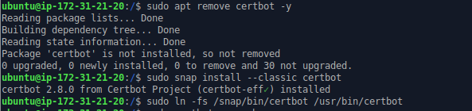
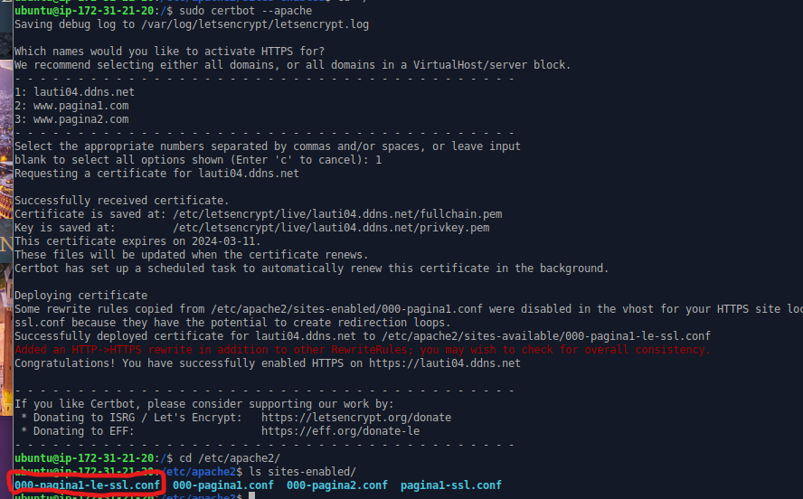
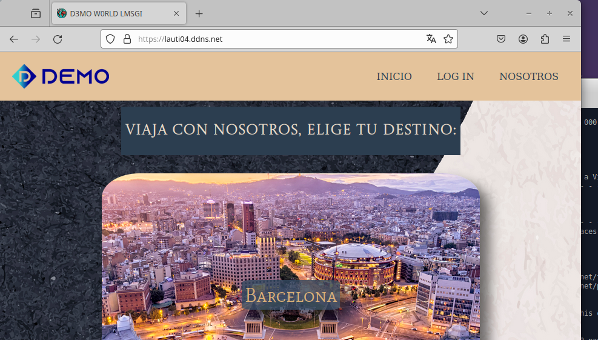

# HTTPS con Let’s Encrypt y Certbot

Esta tarea es bastante sencilla y nuestro primer paso es limpiar por las dudas si hay algo ya en nuestra maquina de cerbot.

    sudo apt remove certbot -y

Luego lo instalamos.

    sudo snap install --classic certbot

Y creamos un simbolico a bin para crear un alias.

    sudo ln -fs /snap/bin/certbot /usr/bin/certbot

Luego como paso final esta tan facil como ejecutar el siguiente comando y rellenar las  preguntas que nos realice en las que debemos indicar la pagina a la que le haremos el certificado.

    sudo certbot --apache

Y ya podemos acceder con https sin problema alguno.

