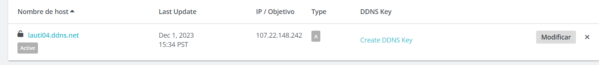
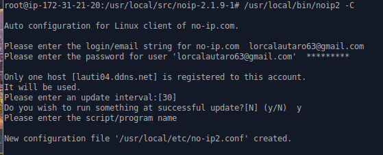
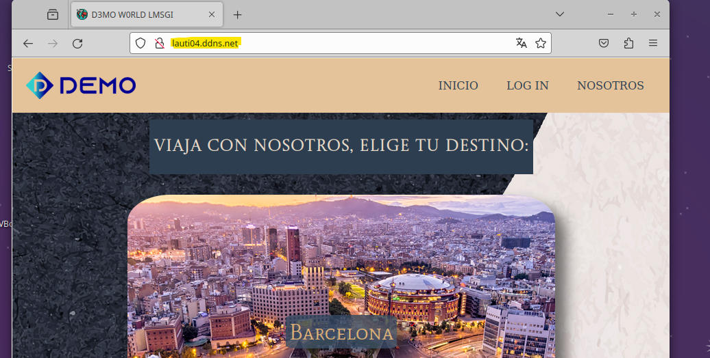
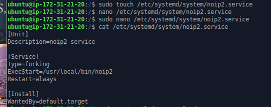
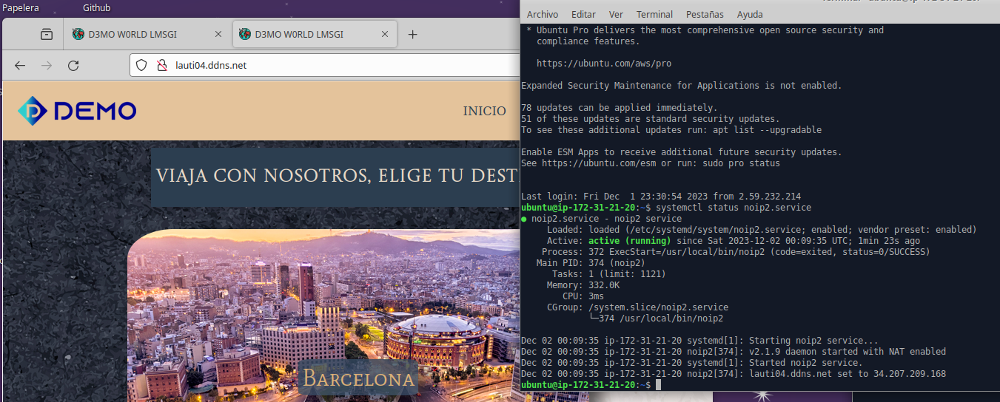

# Configuración NO-IP

Lo primero que hacemos es entrar en la plataforma web https://www.noip.com y crear nuestro propio subdominio

Una vez ya creado nuestro subdominio pasamos a realizar la configuración en nuestro servidor de aws.

---

Luego debemos seguir los siguientes pasos:

Nos situamos en este directorio:

1. cd /usr/local/src 

Realizamos el wget para descargar el archivo para instalar el cliente  de NO-IP:

2. wget http://www.no-ip.com/client/linux/noip-duc-linux.tar.gz

Lo descomprimimos:

3. tar xzf noip-duc-linux.tar.gz
 
4. cd noip-2.1.9-1

Compilamos el archivo:

5. make

Y lo instalamos:

6. make install

---

El siguiente paso es configurar el programa :

    /usr/local/bin/noip2 -C 

Donde nos pide el correo de la cuenta de no-ip y la contraseña y con esto ya tendriamos la configuracion creada con lo que queda solo probarla:

## Parte 2

Lo que haremos es hacerlo un servicio para poder tenerlo siempre activo al encender la maquina.

Empezamos creando el archivo systemd para el servicio :

Luego reiniciamos el demonio de systemctl y ponemos en enable al servicio:

    sudo systemctl daemon-reload

    sudo systemctl enable noip2.service

Ahora probamos reiniciar el equipo y ver que funciona.

Apagamos la maquina y vemos que no va.

Cuando volvemos a encender el equipo vemos el servicio corriendo y el subdominio funcionando.

