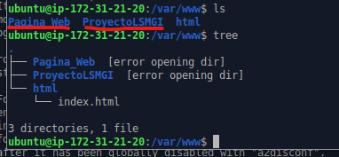
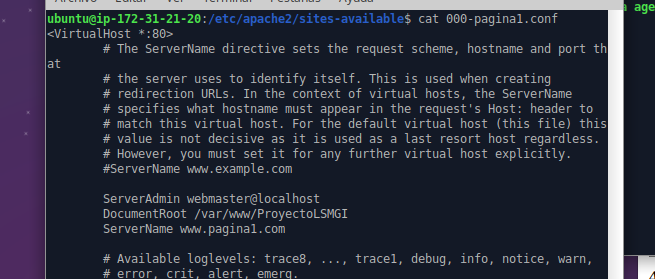
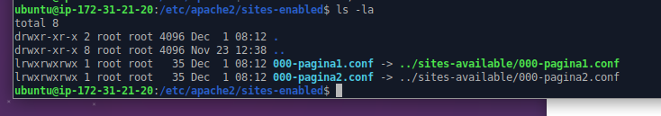
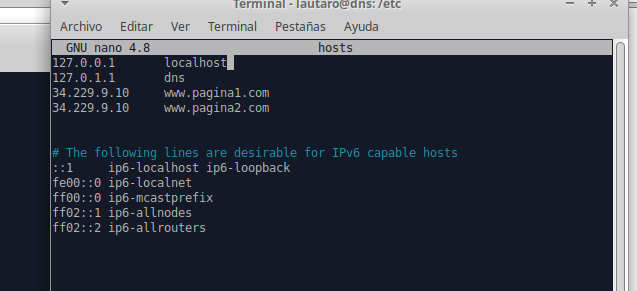
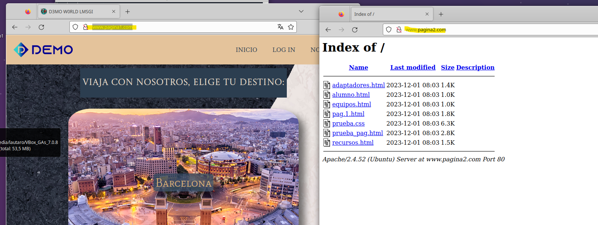

# Configuración de Virtual Hosting

Lo primero que hicimos para empezar con esta configuración fue poner los directorios de las páginas web en la ruta:

    /var/www/->

Donde tenemos las 2 paginas webs que usaremos:

El segundo paso es ir a /etc/apache2/sites-available/ hacer un backup del fichero 000-default.conf y crea uno nuevo partiendos del fichero por defecto con nuestra configuración:

Donde el único cambio que le realizamos al fichero es en DocumentRoot la ubicacionde nuestra web y siguiente en ServerName el dominio que utilizara.
Con estos ficheros creados lo que debemos hacer es avilitarlos con el comando :

    a2ensite 000-pagina1.conf

    a2ensite 000-pagina2.conf

Esto produce un elace simbolico a /etc/apache2/sites-enabled donde se encuentran las paginas avilitadas.

Con esto ya tendriamos la configuración el servidor terminada pero no lograriamos entrar a las paginas desde el cliente ya que el cliente buscaria el dominio en sus propios dns y no los encontraría nunca por lo que debemos editar el fichero /etc/hosts:

Donde agragamos las el ip del servidor y el nombre del dominio que va a buscar.Y con esto damos por finalizado la configuración.

