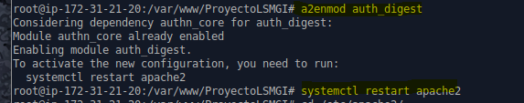
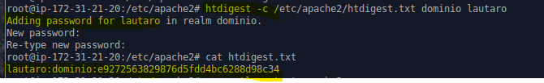
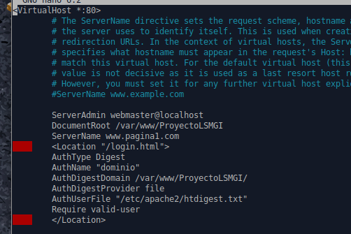
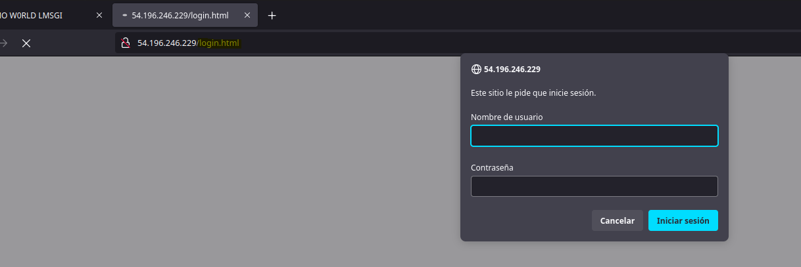
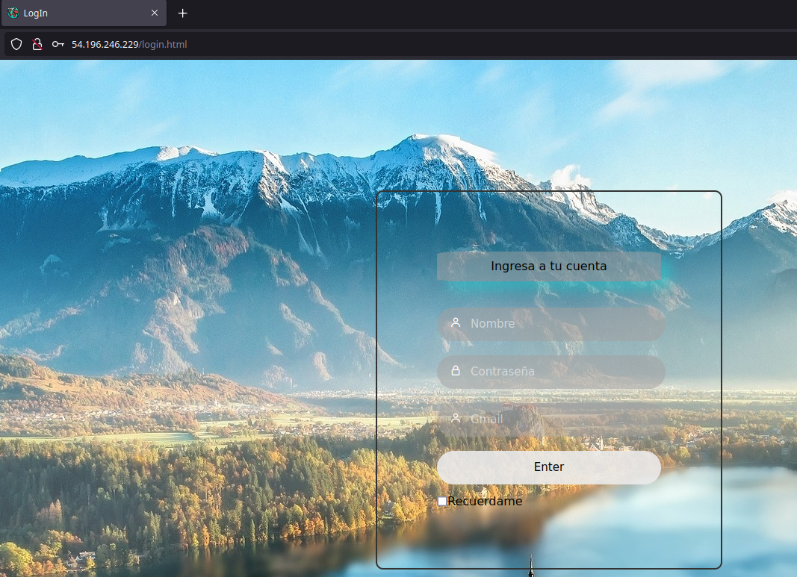

# Autentificación digest

Lo primero que debemos hacer es habilitar el servicio y reiniciar  apache para ponerlo en marcha.

    a2enmod auth_digest

Debemos crear el archivo donde se guardaran todos los usuarios y claves del digest.Ahora creamos el ususario lautaro.

    htdigest -c /etc/apache2/htdigest.txt dominio lautaro

Y  vemos el usuario lautaro ya creado.

Por ultimo debemos editar el archivo de nuestra web y añadirle lo siguiente, donde le indicaremos la zona que estrá bajo seguridad y la configuración.

    <Location "/login.html">
        AuthType Digest
        AuthName "dominio"
        AuthDigestDomain /var/www/ProyectoLSMGI/
        AuthDigestProvider file
        AuthUserFile "/etc/apache2/htdigest.txt"
        Require valid-user
    </Location>

Para finalizar reiniciamos el servicio de apache y provamos.

Y entrando con el usuario lautaro podemos entrar.

