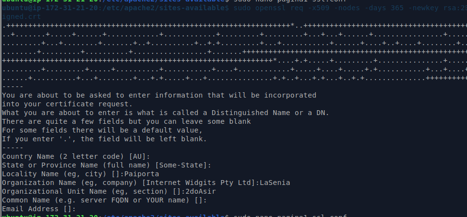
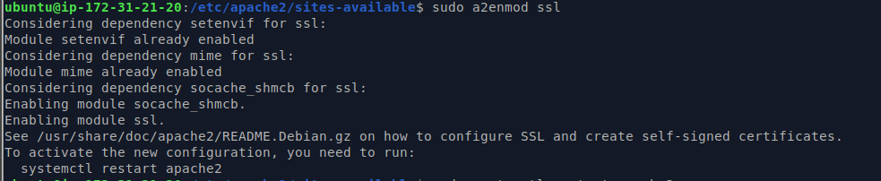
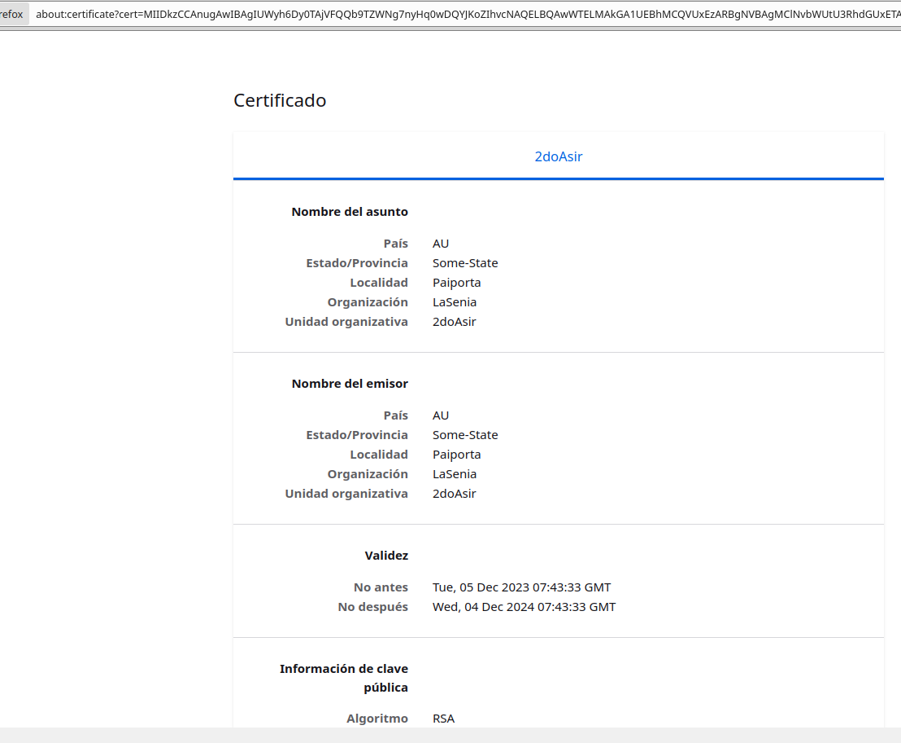

# HTTPS. Creación y configuración de un certificado SSL/TLS autofirmado en Apache

## Creación del certificado autofirmado

Lo primero que vamos a hacer es crear el cerficado con el siguiente comando.

    ubuntu@ip-172-31-21-20:/etc/apache2/sites-available$ sudo openssl req -x509 -nodes -days 365 -newkey rsa:2048 -keyout /etc/ssl/private/apache2-selfsigned.key -out /etc/ssl/certs/apache-selfsigned.crt

Y esto nos pedira algunos datos para el certificado que debemos completar.

El proximo paso es crear otro fichero en /etc/apache2/sites-available para tener otra pagina pero esta vez lo hacemos con el fichero base de default-ssl.conf y ponemos la información de nuestra página.

Luego de tener la página ya creada lo que hacemos es abilitarla:

    sudo a2ensite pagina1-ssl.conf

Habilitamos el modulo:

    sudo a2enmod ssl

Otro paso importante es añadir dentro del primer .conf de la página añadir las siguientes lineas para redirigir el tráfico al puerto 443 donde estara escuchando el ssl.conf:

    # Redirige al puerto 443 (HTTPS)
    RewriteEngine On
    RewriteCond %{HTTPS} off
    RewriteRule ^ https://%{HTTP_HOST}%{REQUEST_URI} [L,R=301]

Habilitamos el siguiente modulo luego reiniciamos apache y deberiamos tener terminada la configuracion:

    sudo a2enmod rewrite

Ahora comprovamos que podemos ingresar con https y que podemos ver el certificado.

