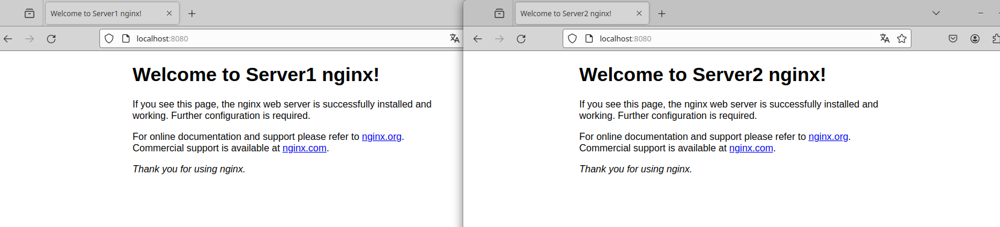

# UD4 – Implantación de soluciones de alta disponibilidad

## Tarea 1 – Balanceo de carga en Nginx
 
---

A partir de las referencias que se muestran al final de documento, vamos a configurar un
balanceador de carga en Nginx. 
Tendremos una infraestructura formada por 3 contenedores. Uno de ellos actuará de
balanceador hacia los otros dos.

El primer paso es crear 3 contenedores docker con nginx uno que será el encargado de hacer el balanceo y 2 servidores de la web.
Debemos apagar cualquier servicio que este ocupando el puerto 80 de nuestra maquina o cambiar de puertos.

        docker run -d --network host --name balanceador a8758716bb6a
        docker run -d -p 81:80 --name server1 a8758716bb6a
        docker run -d -p 82:80 --name server2 a8758716bb6a

Con los 3 contenedore ya creados y iniciados debemos ir a la configuracion del balanceador y entrar en el archivo /etc/nginx/nginx.conf y añadir lo siguiente:

    user  nginx;
    worker_processes  auto;

    error_log  /var/log/nginx/error.log notice;
    pid        /var/run/nginx.pid;

    events {
        worker_connections  1024;
    }

    http {
        upstream myproject {
            server 172.17.0.3:80;
            server 172.17.0.2:80;
        }

        server {
            listen 8080;

            location / {
                proxy_pass http://myproject;
            }
        }
        include       /etc/nginx/mime.types;
        default_type  application/octet-stream;
        log_format  main  '$remote_addr - $remote_user [$time_local] "$request" '
                        '$status $body_bytes_sent "$http_referer" '
                        '"$http_user_agent" "$http_x_forwarded_for"';
        access_log  /var/log/nginx/access.log  main;
        sendfile        on;
        #tcp_nopush     on;
        keepalive_timeout  65;
        #gzip  on;
        include /etc/nginx/conf.d/*.conf;
    }

Configurando las ips y los puertos en los que escuchan los 2 servidores encargados de proporcionar la web.
Ahora para comprobar que todo funciona reiniciamos el contenedor y ingresamo con la ip del balanceador que nos debería redirigir a los 2 servidores en nuestro caso localhost:8080 que fue lo que configuramos en el listen de la configuración:

Vemos que nos redirige una vez al servidor una y otra vez al servidor 2.
Esta forma tardaba un par de conexiones en realizar el cambio pero añadiendo lo siguiente en la configuracion hace el cambio de servidor por cada conexion a la pagina:

    http {
        upstream myproject {
            least_conn;
            server 172.17.0.3:80;
            server 172.17.0.2:80;
        }

Con esta configuración hacemos que soporte 6 conexiones y a la septima la desvie al otro servidor que solo soportara 3, esto lo podemos usar en caso de tener un servidor mas potente que otro y pueda soportar mas conexiones:

    http {
        upstream myproject {
            server 172.17.0.3:80 weight=6;
            server 172.17.0.2:80 weight=3;
        }

