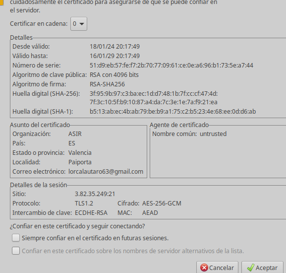
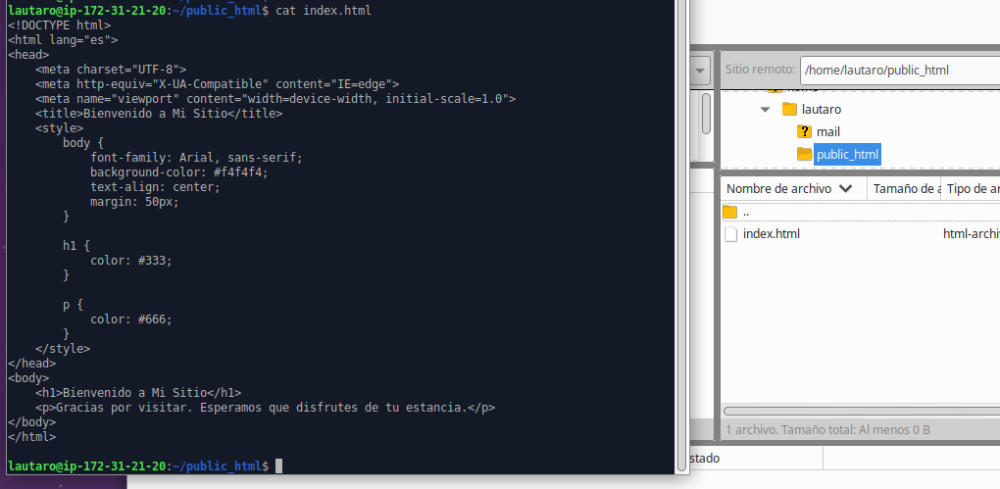
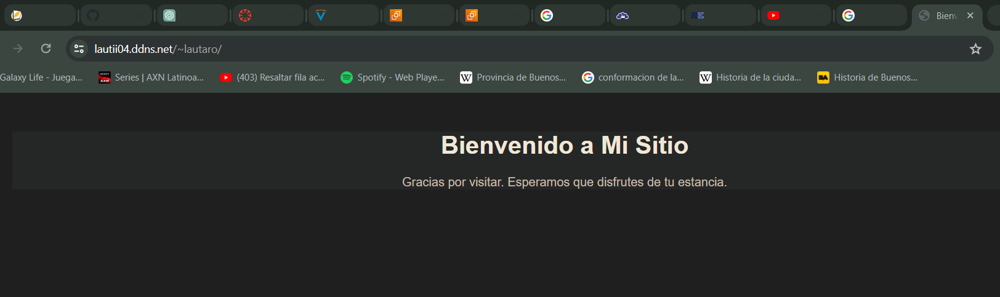

# Configurar servidor FTPS

Instalamos el servidor ftp.

    ubuntu@ip-172-31-21-20:~$ sudo apt install vsftpd

Para habilitar el modo pasivo con el protocolo FTPS Eplícito editamos el archivo /etc/vsftp.conf y lo dejamos con las siguientes lineas utiles:

    listen=NO
    listen_ipv6=YES
    anonymous_enable=NO
    local_enable=YES
    write_enable=YES
    dirmessage_enable=YES
    use_localtime=YES
    xferlog_enable=YES
    chroot_local_user=YES
    chroot_list_enable=YES
    chroot_list_file=/etc/vsftpd.chroot_list
    secure_chroot_dir=/var/run/vsftpd/empty
    pam_service_name=vsftpd
    rsa_cert_file=/etc/ssl/certs/vsftpd.crt
    rsa_private_key_file=/etc/ssl/private/vsftpd.key
    ssl_enable=YES

    force_local_data_ssl=YES
    force_local_logins_ssl=YES
    ssl_ciphers=HIGH
    require_ssl_reuse=NO

    pasv_enable=YES
    pasv_min_port=4000
    pasv_max_port=5000

Como indicamos en  la chroot list creamos ese archivo y ingresamos los usuarios que se podran logear.

    ubuntu@ip-172-31-21-20:/$ cat /etc/vsftpd.chroot_list 
    lautaro

Y luego debemos crear el usuaio e crear la carpeta public_html para poder subir los archivos allí.
Como queremos que al subir a traves del filezilla los archivos respectivos a de la pagina web del usuario lo que debemos hacer es crear el fichero para permitir esa pagina y habilitarlo.

    ubuntu@ip-172-31-21-20:/$ cat /etc/apache2/sites-enabled/filezilla.conf

    <VirtualHost *:80>
        ServerAdmin lautii04.ddns.net
        DocumentRoot /home/lautaro/public_html

        <Directory /home/lautaro/public_html>
            Options Indexes FollowSymLinks
            AllowOverride None
            Require all granted
        </Directory>

        ErrorLog ${APACHE_LOG_DIR}/error.log
        CustomLog ${APACHE_LOG_DIR}/access.log combined
    </VirtualHost>

Con esto ya configurado abrimos filezilla y lo configuramos para conectarnos a nuestro servidor:

Ingresamos con la contraseña del usuario:

Y vemos que al conectarse nos muestra nuestro certificado:

Y ya tenemos el home del usuario disponible y enjaulado:

Ahora compartimos desde nuestro local una pagina al public html.

Y probamos de ingresar a la página:

Ya vemos que podemos ingresar con el dominio y el nombre de usuario y que esta todo en orden.

