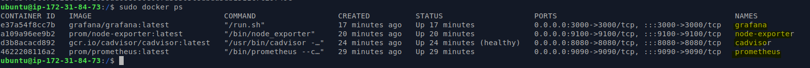
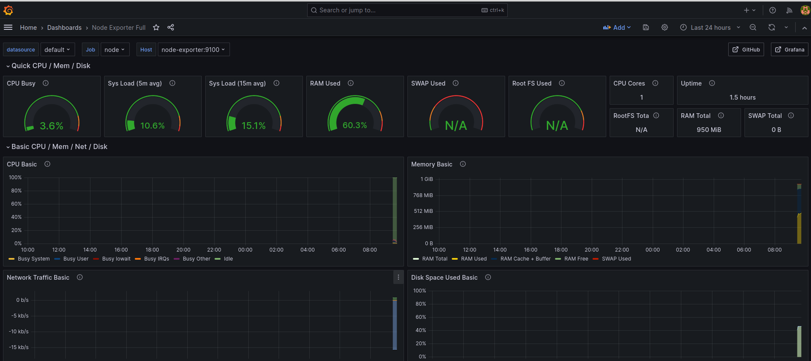

# Reto 7. Monitorización de un servidor
### Monitorizar un servidor. Prometheus + grafana  cAdvisor + grafana

Luego de seguir el tutorial completo de :

     https://www.webhi.com/how-to/docker-monitoring-using-prometheus-cadvisor-node-exporter-grafana/

Y tener todos los contenedores creados y ejecutandose:  

Ingresamos a grafana añadimos un data source configurandolo con la dirección de nuestro  Prometheus y vemos que ya podemos usar diferentes Dashboards y funcionan:

Este dashboard nos da información especifica de los comtenedores:

Y este de la maquina en completo:

