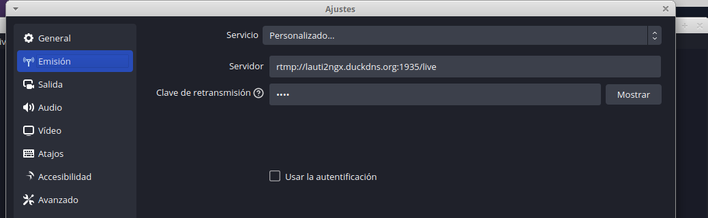
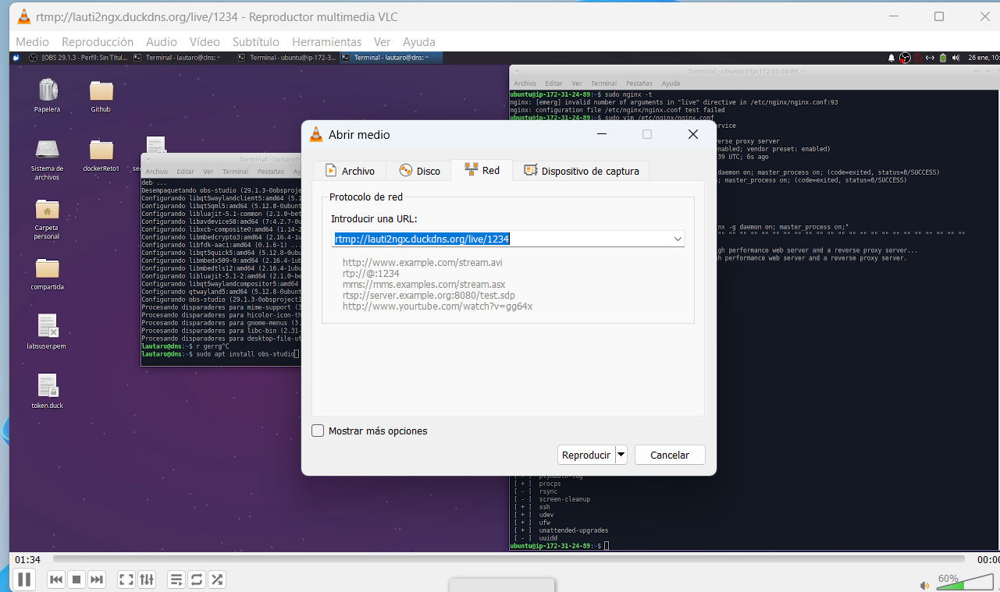
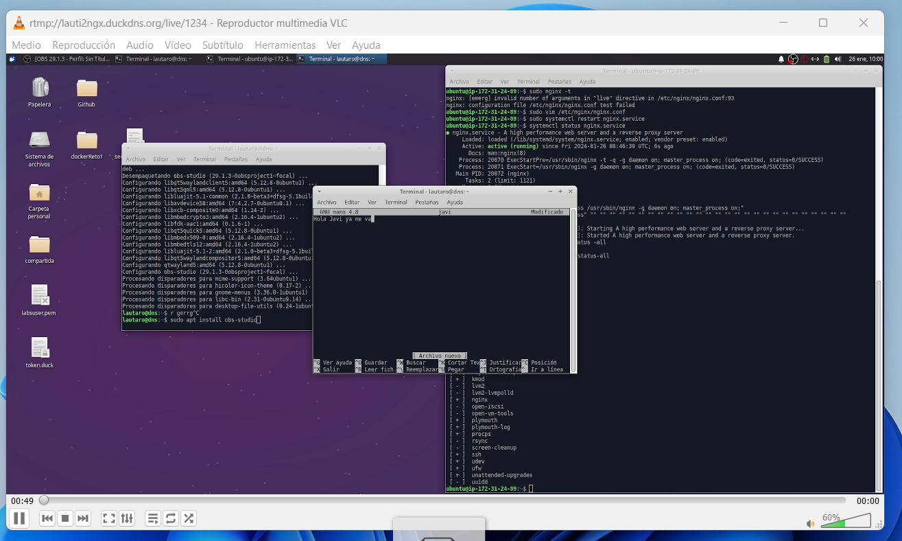

# Reto 5. Servidor Streaming
### Primer paso
Instalar ngingx con sus modulos necesarios:

    sudo apt update
    sudo apt install nginx-full
    sudo apt install libnginx-mod-rtmp 

Ahora configuramos el fichero de configuración de nginx y añadimos esto al final del fichero:

    sudo vim /etc/nginx/nginx.conf 
    
        rtmp{
            server {
                    listen 1935;
                    chunk_size 4096;

                    application live{
                            live on:
                            record off;
                    }
            }
        }

Instalamos OBS:

    sudo add-apt-repository ppa:obsproject/obs-studio
    sudo apt install obs-studio

Y iniciamos las pruebas:

En obs especificamos el servidor donde se va a transmitir:

Y en VLC media player especificamos donde queremos ver la transmición:

Y ya vemos que podemos ver el home de nuestra maquina donde tenemos el obs:

