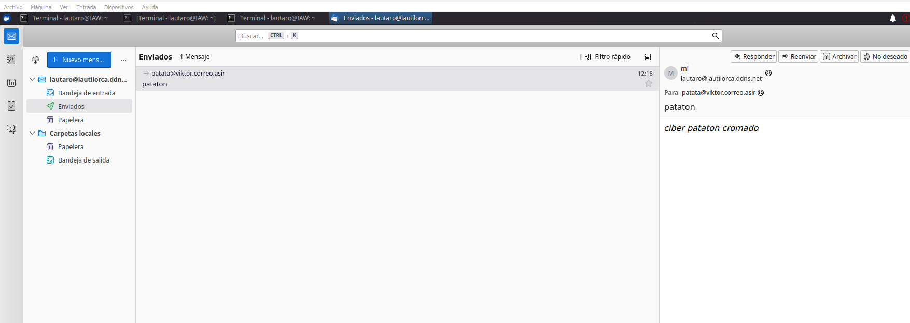

# Reto 6. Servidor de correo electrónico

En la instancia que hemos implementado docker con nginx vamos a implementar un servicio de correo electrónico. Para ello, configuraremos 

. MTA. Postfix con los protocolos SMTP y STARTTLS.

. MDA. Dovecot con los protocolos IMAP, IMAPs y opcionalmente POP3 y POP3s

Para realizar las pruebas utilizar Thunderbird como MUA.
Como ampliación podéis configurar una aplicación WEB para el correo electrónico  https://squirrelmail.org/

---
---

## Instalamos Postfix
Instalamos y configuramos postfix (al instalarlo en las opciones de instalación debemos poner ninguna configuración):

    sudo apt -y install postfix sasl2-bin 

Copiamos el siguiente archivo a esta ruta:

    sudo cp /usr/share/postfix/main.cf.dist /etc/postfix/main.cf

Y lo editamos para hacer la configuración manual, estas son las lineas utilizables del archivo:

    compatibility_level = 3.6
    command_directory = /usr/sbin
    daemon_directory = /usr/lib/postfix/sbin
    data_directory = /var/lib/postfix
    mail_owner = postfix
    myhostname = mail.lautilorca.ddns.net
    mydomain = lautilorca.ddns.net
    myorigin = $myhostname
    inet_interfaces = all
    mydestination = $myhostname, localhost.$mydomain, localhost, $mydomain
    local_recipient_maps = unix:passwd.byname $alias_maps
    unknown_local_recipient_reject_code = 550
    mynetworks_style = subnet
    mynetworks = 127.0.0.0/8, 0.0.0.0/0
    alias_maps = hash:/etc/aliases
    alias_database = hash:/etc/aliases
    home_mailbox = Mailbox
    smtpd_banner = $myhostname ESMTP
    debugger_command =
        PATH=/bin:/usr/bin:/usr/local/bin:/usr/X11R6/bin
        ddd $daemon_directory/$process_name $process_id & sleep 5
    sendmail_path = /usr/sbin/postfix
    newaliases_path = /usr/bin/newaliases
    mailq_path = /usr/bin/mailq
    setgid_group = postdrop
    inet_protocols = ipv4
    disable_vrfy_command = yes
    smtpd_helo_required = yes
    message_size_limit = 10240000
    smtpd_sasl_type = dovecot
    smtpd_sasl_path = private/auth
    smtpd_sasl_auth_enable = yes
    smtpd_sasl_security_options = noanonymous
    smtpd_sasl_local_domain = $myhostname
    smtpd_recipient_restrictions = permit_mynetworks, permit_auth_destination, permit_sasl_authenticated, reject

Ejecutamos el siguiente comando 

    sudo newaliases

Y reiniciamos el postfix y vemos que no nos de errores.

---
---

## Instalamos Devcot

instalamos devcot:

    sudo apt -y install dovecot-core dovecot-pop3d dovecot-imapd

Editamos el fichero (/etc/dovecot/dovecot.conf) y descomentamos la siguiente linea:

     30 listen = *, ::

Editamos el fichero (/etc/dovecot/conf.d/10-auth.conf) , descomentamos y editamos las siguiente linea:

     10 disable_plaintext_auth = no
    100 auth_mechanisms = plain login

Editamos el fichero (/etc/dovecot/conf.d/10-master.conf) , descomentamos y editamos las siguiente linea:

    106   # Postfix smtp-auth
    107   unix_listener /var/spool/postfix/private/auth {
    108     mode = 0666
    109     user = postfix
    110     group = postfix
    111   }

Reiniciamos el servicio y vemos que no nos de ningun error.

---
---

## Añadir cuentas de mail

Instalamos:

    sudo apt -y install mailutils

Establecemos la siguiente variable de entorno para usar Maildir

    echo 'export MAIL=$HOME/Maildir/' >> /etc/profile.d/mail.sh

Añadimos un usario nuevo para hacer una prueba

    sudo adduser lautaro

Y mandamos un mail al local de la siguiente forma:

    ubuntu@ip-172-31-82-215:~$ mail lautaro@localhost
    Cc: 
    Subject: Test mail #1
    This is my first mail from my new server

Ahora para comprobar que tenemos el mail vamos al home del usuario lautaro y tendremos el archivo Mailbox y veremos algo como esto:

    lautaro@ip-172-31-82-215:~$ cat Mailbox
    From ubuntu@ip-172-31-82-215.ec2.internal  Fri Feb  2 10:32:55 2024
    Return-Path: <ubuntu@ip-172-31-82-215.ec2.internal>
    X-Original-To: lautaro@localhost
    Delivered-To: lautaro@localhost
    Received: by mail.lautilorca.ddns.net (Postfix, from userid 1000)
        id 54E2D403FD; Fri,  2 Feb 2024 10:32:55 +0000 (UTC)
    To: <lautaro@localhost>
    Subject: Test mail #1
    User-Agent: mail (GNU Mailutils 3.14)
    Date: Fri,  2 Feb 2024 10:32:55 +0000
    Message-Id: <20240202103255.54E2D403FD@mail.lautilorca.ddns.net>
    From: Ubuntu <ubuntu@ip-172-31-82-215.ec2.internal>

    This is my first mail from my new server

---
---

## Configuración de cliente Thunderbird

Lo instalamos:

    sudo apt install thunderbird

Y ingresemos con la configuracion manual:

Hacemos la comprovación de mandar un mail desde Gmail y vemos que lo recibimos:

Vimos que no teniamos la configuración perfecta por lo que editamos lo siguiente:

Para el Postfix editamos en el archivo /etc/postfix/main.cf la suiguiente linea:

    #home_mailbox = Mailbox
    home_mailbox = Maildir/

Luego para el dovecot editamos /etc/dovecot/conf.d/10-mail.conf y descomentamos esta linea comentando la que teniamos respectiva a la misma configuración:

       mail_location = maildir:~/Maildir

Esto lo configuramos para que a la hora de recibir los mails lo podamos tener mas ordenados de la siguiente manera:

    lautaro@ip-172-31-82-215:~/Maildir$ tree -r
    .
    ├── tmp
    ├── new
    ├── dovecot.list.index.log
    ├── dovecot.index.log
    ├── dovecot.index.cache
    ├── dovecot-uidvalidity.65c1e472
    ├── dovecot-uidvalidity
    ├── dovecot-uidlist
    └── cur
        ├── 1707206646.Vca01I4be44M549376.ip-172-31-82-215:2,S
        ├── 1707205970.Vca01I441e2M576626.ip-172-31-82-215:2,S
        └── 1707205480.Vca01I4babbM927706.ip-172-31-82-215:2,S

    3 directories, 9 files

Como vemos tenemos el directorio Maildir donde tenemos las carpetas importantes new donde estaran los correos nuevos y cur donde estaran los ya abiertos.

Con esto vemos que el servidor ya funciona pero ahora arrancaremos con la configuración de TLS para que sea seguro.

Procedemos a instalar Cerbot

    sudo apt -y install certbot 

Y utilizamos el comando para crear el certificado :

    sudo certbot certonly --standalone -d lautilorca.ddns.net

Ahora vamos a configurar el certificado en el archivo de configuración del postfix /etc/postfix/main.cf:

    #TLS CONFIGURATION

    smtpd_use_tls = yes
    smtp_tls_mandatory_protocols = !SSLv2, !SSLv3
    smtpd_tls_mandatory_protocols = !SSLv2, !SSLv3
    smtpd_tls_cert_file = /etc/letsencrypt/live/lautilorca.ddns.net/fullchain.pem
    smtpd_tls_key_file = /etc/letsencrypt/live/lautilorca.ddns.net/privkey.pem
    smtpd_tls_session_cache_database = btree:${data_directory}/smtpd_scache

Y tambien editamos el fichero de configuración de master.cf

    19 submission inet n       -       y       -       -       smtpd
        20   -o syslog_name=postfix/submission
        21 #  -o smtpd_tls_security_level=encrypt
        22   -o smtpd_sasl_auth_enable=yes

    # add to the end
    smtps     inet  n       -       y       -       -       smtpd
    -o syslog_name=postfix/smtps
        -o smtpd_tls_wrappermode=yes
        -o smtpd_sasl_auth_enable=yes

Editamos el fichero /etc/dovecot/conf.d/10-ssl.conf:

    6 ssl = yes
    12 ssl_cert = </etc/letsencrypt/live/lautilorca.ddns.net/fullchain.pem
    13 ssl_key = </etc/letsencrypt/live/lautilorca.ddns.net/privkey.pem

Ahora para realizar la configuración vamos al thunderbird y cambiamos la configuración de la siguiente manera:

Probamos IMAP una vez con el puerto STARTTLS:

Y otra con SSL/TLS:

Y SMTP vemos que este configurado con STARTTLS:

Y hacemos la confirmación de que funciona mandando correos desde Gmail y viendo que llegan.
