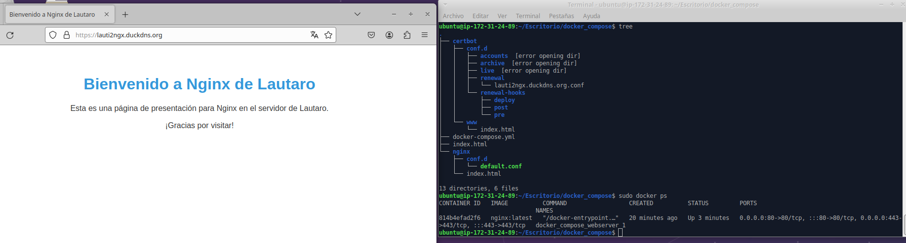

# Reto 4. WEB externa

## Precisamente ahora que dominamos Apache, nos han pedido que alojemos una WEB externa. Para ello vamos a crear una nueva instancia en AWS y configurarla con un contenedor NGINX.

Primero creamos una nueva instancia de aws para este nuevo proyecto.

Para realizar esta tarea vamos  a crear un docker compose donde vamos a crear el contenedor de nginx y de cerbot para los certificados y lograr utilizar https. 

Creamos la siguiente rama de directorios y archivos:

    ubuntu@ip-172-31-24-89:~/Escritorio/docker_compose$ tree
    .
    ├── certbot
    └── nginx
        └── conf.d
            └── default.conf

El siguiente paso es editar el archivo de configuracion de nginx:

        server {
            listen 80;
            listen [::]:80;

            server_name lauti2ngx.duckdns.org;
            server_tokens off;

            location /.well-known/acme-challenge/ {
                root /var/www/certbot;
            }

            location / {
                root /var/www/certbot;
                index index.html;
                try_files $uri $uri/ =404;
            }
        }

    
Y crear el archivo de configuración del docker compose que lo llamamos docker-compose.yml donde creamos lo volumenes necesarios y especificamos las imagenes de creación de cada contenedor:

version: '3'
 
services:
  nginx:
    image: nginx:latest
    ports:
      - 80:80
      - 443:443
    restart: always
    volumes:
      - ./nginx/conf.d/:/etc/nginx/conf.d/:ro

Con esto ya lo ejecutamos para crear los contenedores:

    docker-compose up -d

Y recibimos la siguente salida viendo que se ejecuto correctamente:

    Creating docker_compose_webserver_1 ... done
    Creating docker_compose_certbot_1   ... done

Ya podemos ingresar por http

Ahora para poder ingresar por https volvemos a editar el archivo del docker-compose.yml:

    version: '3'
 
    services:
    
    webserver:
        image: nginx:latest
        ports:
        - 80:80
        - 443:443
        restart: always
        volumes:
        - ./nginx/conf.d/:/etc/nginx/conf.d/:ro
        - ./certbot/www/:/var/www/certbot/:ro
        - ./certbot/conf.d/:/etc/nginx/ssl/:ro

    
    certbot:
        image: certbot/certbot:latest
        volumes:
        - ./certbot/www/:/var/www/certbot/:rw
        - ./certbot/conf.d/:/etc/letsencrypt/:rw

Lo volvemos a levantar con docker-compose up -d y ejecutamos el siguiente comando para generar los certificados cel cerbot:

    ubuntu@ip-172-31-24-89:~/Escritorio/docker_compose$ sudo docker-compose run --rm  certbot certonly --webroot --webroot-path /var/www/certbot/ -d lauti2ngx.duckdns.org

Y vemos que nos genero los certificados y nos da la ruta:

    Successfully received certificate.
    Certificate is saved at: /etc/letsencrypt/live/lauti2ngx.duckdns.org/fullchain.pem
    Key is saved at:         /etc/letsencrypt/live/lauti2ngx.duckdns.org/privkey.pem

Ahora editamos el fichero de configuración de nuestra web para habilitar el https y indicarle el path de nuestra web:

    server {
        listen 80;
        listen [::]:80;

        server_name lauti2ngx.duckdns.org;
        server_tokens off;

        location /.well-known/acme-challenge/ {
            root /var/www/certbot;
        }

        
        location / {
            root /var/www/certbot;
            index index.html;
            try_files $uri $uri/ =404;
        }
    }

    server {
        listen 443 ssl http2;
        listen [::]:443 ssl http2;

        server_name lauti2ngx.duckdns.org;

        ssl_certificate /etc/nginx/ssl/live/lauti2ngx.duckdns.org/fullchain.pem;
        ssl_certificate_key /etc/nginx/ssl/live/lauti2ngx.duckdns.org/privkey.pem;

        location / {
            root /var/www/certbot;
            index index.html;
            try_files $uri $uri/ =404;
        }
    }

Realizamos la misma acción de parar y volver a levantar el docker compose y poder ingresar a nuestra web de forma segura:

